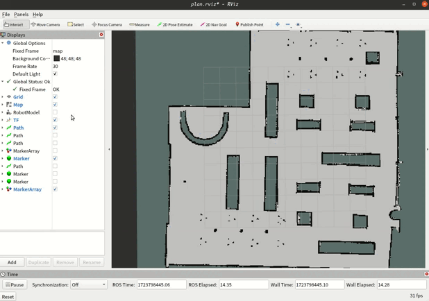
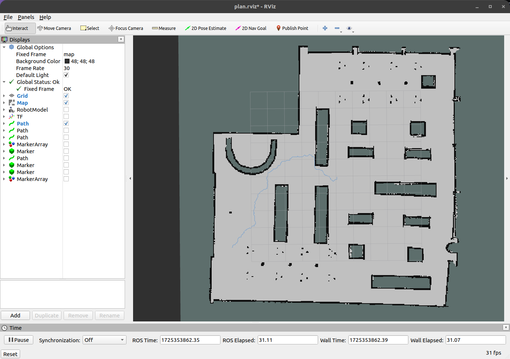
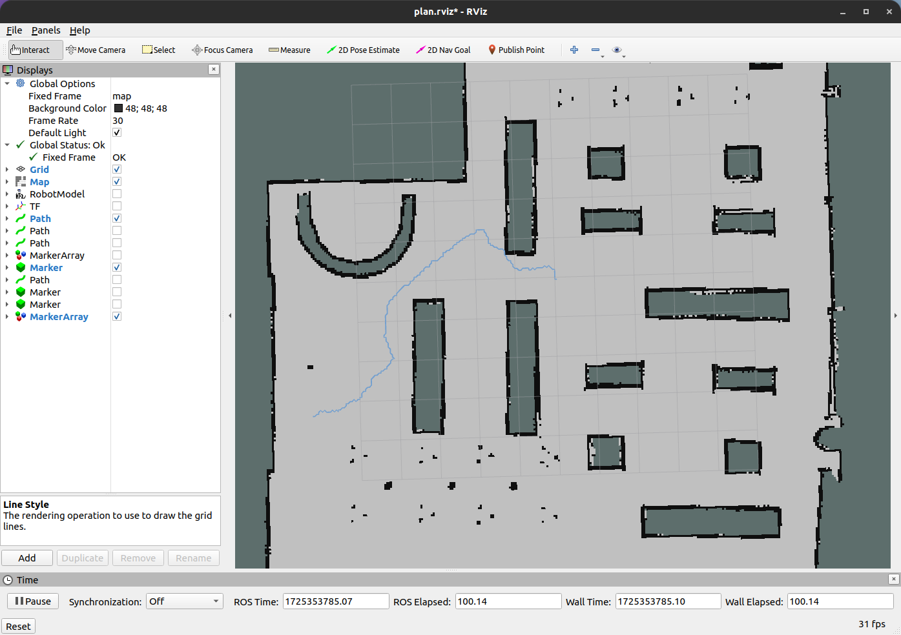
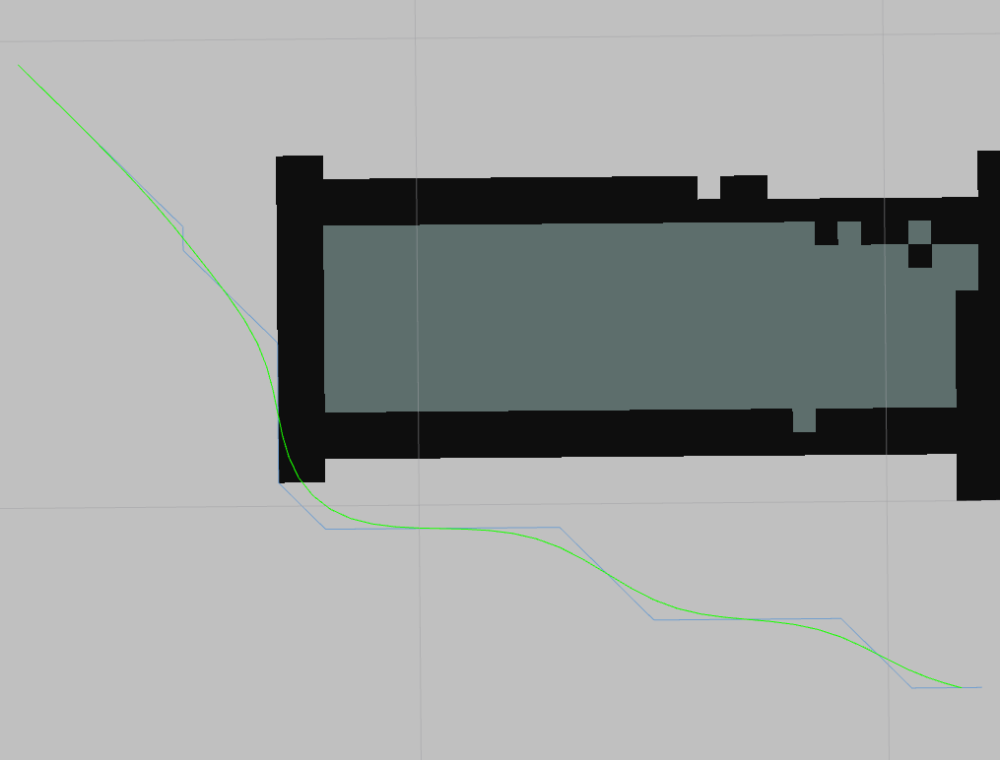
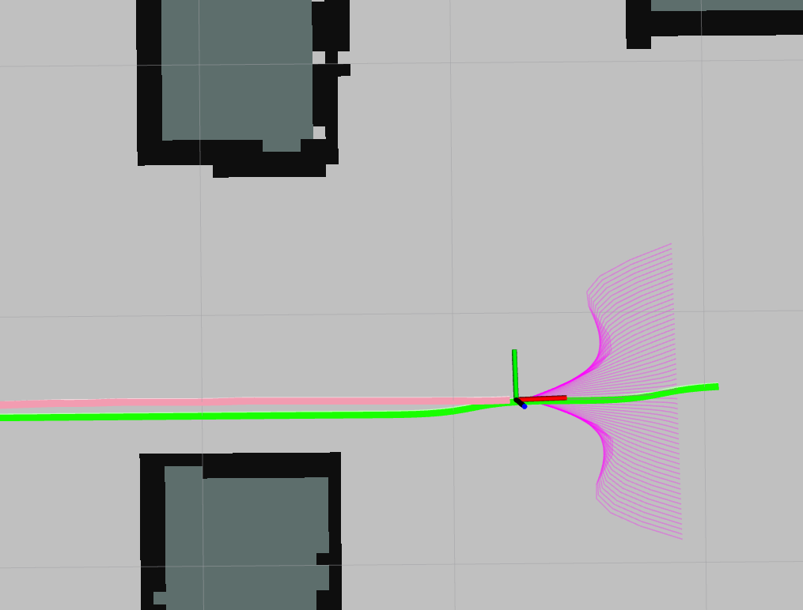
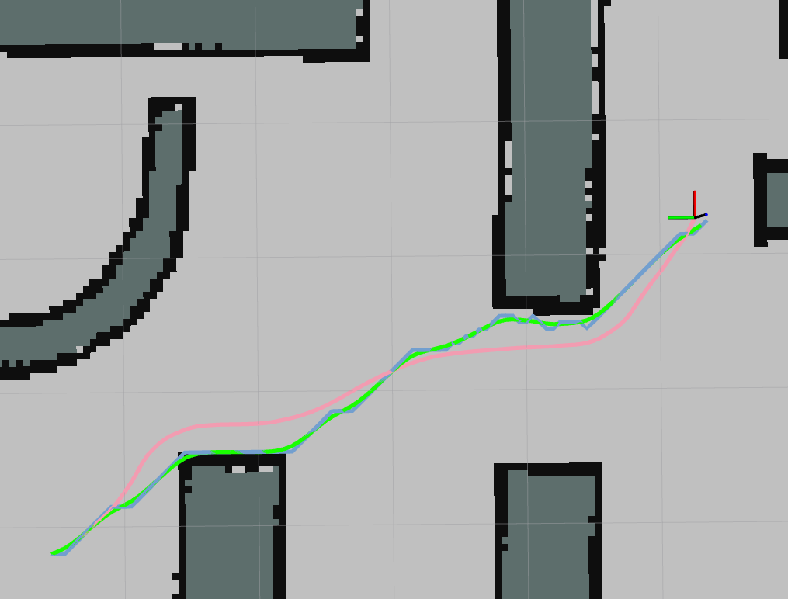

# planner
该仓库是一个规划的整体框架，是我个人对规划的理解实践内容，该仓库将持续更新。

## 运行

需要有Eigen，Osqp-Eigen库

1. ``git clone https://github.com/Raiden49/planner.git``
2.  ``cd planner``
3. ``cmake -B ./build``
4. ``cmake --build ./build``
5. ``source ./build/devel/setup.bash(zsh)``
6. ``ros launch planner plan.launch``

## 项目内容

### 1. 全局规划

- Astar
- Hybrid Astar
- RRT
- RRTstar

### 2. 路径优化

- 二次规划优化路径(QP)
- 分段三次贝塞尔曲线优化路径(Bezier)
- 三次B样条曲线优化路径(BSpline)

### 3. 局部规划

- 三次样条生成几百条路径
- 五次多项式生成几十条路径
- 最优路径选择与后处理优化 

### 4. 控制器仿真

对于轨迹跟踪，并没有使用实际的控制器，只是利用ROS的TF变换进行模拟控制器完美跟踪路径的操作

## 效果展示

### 1. 全局规划

#### HybridA*

#### RRT

#### RRT*

### 2. 路径优化

#### 优化示例

#### QP方法

#### Bezier方法

#### Bspline方法

### 3. 局部规划

#### 三次样条

#### 五次多项式

### 4. 控制器跟踪

规划路径为蓝色，优化后的全局路径为绿色，最终局部规划引导的轨迹为粉红色

## 更新日志

### 2024/09/03

添加RRT, RRT*规划方法

### 2024/08/16

添加Hybrid A*规划方法

### 2024/06/26

初版本上传

## 目前存在的BUG

- ~~前后两个周期局部规划计算出的最优路径可能相差较大，导致抖动较为严重，尤其是路径数量较多的offline三次样条方法~~
- ~~混合Ａ＊搜索时并不是基于图像坐标系，这使得规划出的点转换到图像坐标系，有时候会无法准确判断障碍物，导致规划轨迹穿过障碍物~~
- 较近的距离进行Hybrid A*搜索路径时，程序报错停止
- RRT, RRT*搜索不稳定，有时搜索到路径耗时很短，但有时耗时奇长（感觉是RRT本身纯随机的缺点）
